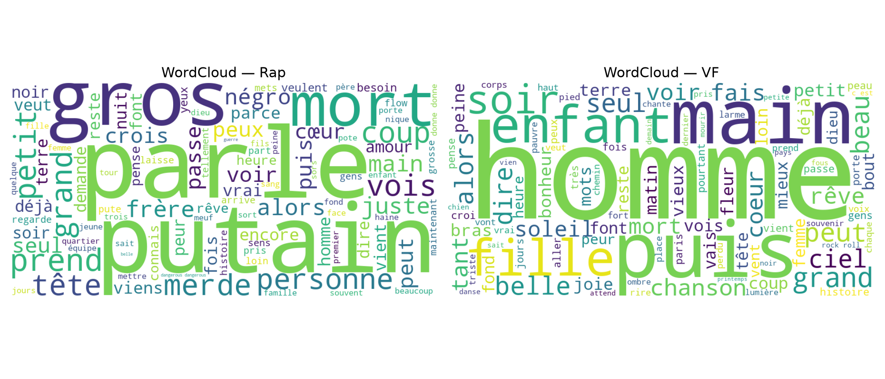
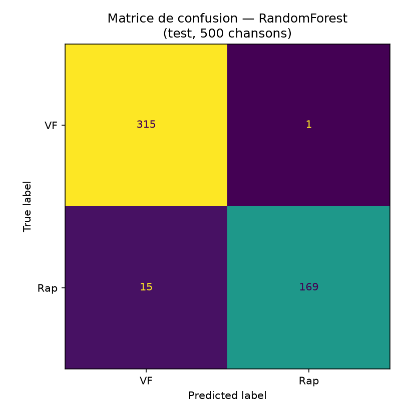

# Classification de paroles (Rap vs Variété Française) - NLTK & scikit-learn


## Objectif
Construire un pipeline de **text mining / NLP** permettant de **classer des paroles de chansons** en deux catégories :
- **Rap**
- **Variété Française (VF)**

Le projet couvre :
- une **analyse exploratoire (EDA)**,
- un pipeline de **prétraitement NLP** (NLTK + stopwords personnalisés),
- des features **TF-IDF** et des **modèles supervisés** (scikit-learn),
- l’**évaluation** et l’**interprétation** (erreurs, limites).

📄 Rapport complet du projet : [docs/Rapport_classification_paroles_Rap_vs_VF.pdf](docs/Rapport_classification_paroles_Rap_vs_VF.pdf) ([.docx](docs/Rapport_classification_paroles_Rap_vs_VF.docx))

## Données
Les données sont fournies sous forme de fichiers CSV par artiste, puis consolidées en un dataset unique.

- **2 633 chansons**
- **VF : 1 718** (≈ 65%)
- **Rap : 915** (≈ 35%)

Structure :
```
data/
  chansons/
    Rap/*.csv
    VF/*.csv
  stopword.txt
```

Chaque CSV contient une colonne `lyrics` (paroles).



## Structure du projet
```
src/lyrics_classification/  # code réutilisable (chargement des données, prétraitement texte, entraînement)
tests/                      # tests unitaires (pytest)
notebooks/                  # EDA + modélisation
data/                       # CSV bruts par artiste + dataset consolidé
models/                     # modèle entraîné, prêt pour la démo
app.py                      # démo Streamlit
```

## Démo
Un modèle déjà entraîné (`models/model.joblib`) est fourni pour tester le classifieur :
```bash
pip install -e ".[demo]"
streamlit run app.py
```
Interface (large, KPI en haut, paroles/résultat côte à côte) : colle des paroles en français, le modèle prédit Rap/VF avec un score de confiance et un wordcloud des mots ayant le plus pesé dans la décision. Thème custom via `.streamlit/config.toml`.

Pour ré-entraîner le modèle (ex. après une mise à jour des données) :
```bash
python -m lyrics_classification.model
```

## Notebooks
- `notebooks/01_eda_rap_vs_vf.ipynb`  
  Analyse exploratoire : qualité des données, distributions, longueur des paroles, lexique, wordclouds, insights & limites.

- `notebooks/02_modeling_rap_vs_vf.ipynb`  
  Modélisation : pipeline TF‑IDF + modèles scikit‑learn, **cross‑validation**, optimisation, matrices de confusion et analyse d’erreurs.

- `notebooks/03_zeroshot_camembert_comparison.ipynb`  
  Comparaison avec un modèle pré-entraîné utilisé en **zero-shot** (CamemBERT distillé, aucun entraînement sur nos données) face au modèle supervisé, sur les mêmes chansons de test. Nécessite `pip install -e ".[zeroshot]"`.
  **F1 macro zero-shot : 0.5705** vs **0.965** pour le modèle supervisé. Le zero-shot capte un signal (66% de rappel sur le Rap) mais reste loin du modèle entraîné, comme attendu.

## Méthodologie
- **Prétraitement** : normalisation (minuscule, espace vide), stopwords (NLTK + liste custom)
- **Vectorisation** : TF‑IDF (mots / n‑grams)
- **Split & validation par artiste** : le split train/test et la cross‑validation interne sont **groupés par artiste** (`StratifiedGroupKFold`), pas par chanson. Aucun artiste n'apparaît à la fois en train et en test, pour éviter que le modèle apprenne une "signature d'artiste" plutôt qu'un style de genre.
- **Évaluation** :
  - **Cross‑validation** sur le train (métrique principale : **F1 macro**), moyennée sur 5 folds group-aware
  - **Test final** sur un jeu séparé (artistes jamais vus à l'entraînement)
- **Interprétation** :
  - analyse d’erreurs (faux positifs / faux négatifs)

## Résultats
Meilleur modèle sélectionné via CV (F1 macro) : **RandomForest** sur features TF‑IDF.

- **CV (5 folds, groupée par artiste)**
  - **F1 macro : 0.9198 ± 0.0423**
- **Test** (6 artistes jamais vus à l'entraînement)
  - **F1 macro : 0.965**
  - **F1 (Rap) : 0.9548**
  - **Accuracy : 0.97**

> Les classes étant déséquilibrées (VF > Rap), **F1 macro** est privilégiée en complément de l’accuracy.

| Version | F1 macro (test) | F1 macro CV (± std) |
|---|---|---|
| Split par chanson (fuite d'artiste) | 0.9632 | 0.9486 ± 0.0076 |
| Split par artiste (bug stopwords custom) | 0.9606 | 0.9203 ± 0.0551 |
| Split par artiste + stopwords corrigés | **0.965** | **0.9198 ± 0.0423** |



> Avec un split par chanson (sans regroupement par artiste), le score de CV était trompeusement stable : le modèle apprenait en partie des artistes plutôt que du genre. Avec le split correct par artiste, l'écart‑type de CV reflète l'incertitude réelle de généralisation à de nouveaux artistes (à considérer comme l'estimation la plus fiable).

## Exécution
Depuis la racine du projet :
```bash
python -m venv .venv
.venv\Scripts\activate      # Windows
pip install -r requirements.txt
```
Puis ouvrir les notebooks dans `notebooks/`.

## Tests
```bash
pip install -e .
pytest
```

## Limites & pistes d’amélioration
- **Biais artiste** : ~~le modèle peut apprendre...~~ ✅ corrigé - split et CV groupés par artiste (`StratifiedGroupKFold`).
- **Biais de longueur** : les paroles de Rap sont souvent plus longues, ce qui peut faciliter la classification.
- **Diversité limitée du test** : avec ~13 artistes par genre, le split de test retenu ne contient qu'un seul artiste VF (Johnny Hallyday). Le score de CV (moyenné sur 5 folds) est une estimation de généralisation plus fiable que ce seul test.

Pistes :
- ~~comparaison avec un modèle transformer (CamemBERT)~~ ✅ fait (`notebooks/03`, F1 macro 0.5705 en zero-shot),
- (optionnel) représentation plus riche (char n‑grams).

## Références
- NLTK : https://www.nltk.org/
- scikit-learn : https://scikit-learn.org/
